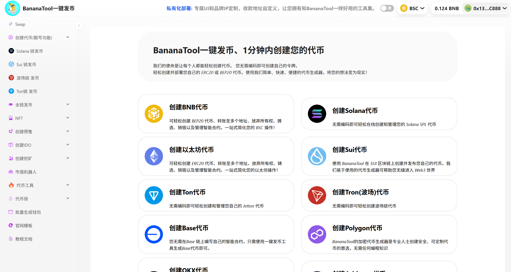

# BananaTool一键发币助手
BananaTool作为全网领先的一键发币工具，彻底终结代币开发的技术壁垒！用户无需任何代码基础，1分钟即可在BSC、Solana、SUI、ETH、Base、Arbitrum、TON、Tron等多条主流公链上完成代币部署。通过可视化操作界面，轻松配置代币参数、滑点机制及通缩模型，同步集成批量空投、智能锁仓、市值管理、代币预售、代币挖矿及IDO启动板等全生态工具。无论您是DEFI开发者、初创项目方还是加密爱好者，均可低成本快速发行合规代币，真正实现"1分钟发币→5分钟上交易所"的行业极限效率，开启全民代币化时代！

**官网**：https://bananatool.com/

**Solana一键发币**：https://solana.bananatool.com/

**TON一键发币**：https://ton.bananatool.com/

**Sui一键发币**：https://sui.bananatool.com/

**波场工具助手**：https://tron.bananatool.com/

**交流群**: https://t.me/bananatools

## **代币模板/机制** 

[标准代币](https://www.bananatool.com/token/Standard)：干净合约、方便上手、无税无功能、Ave检测全绿

[营销回流代币](https://www.bananatool.com/token/Reflow)：获取营销手续费，营销代币

[持币分红](https://www.bananatool.com/token/HoldDiv)：用户持有代币获得分红，增加用户粘性

[黑洞分红](https://www.bananatool.com/token/blackHold)：销毁代币，获取分红，减少代币总量

[LP分红代币](https://www.bananatool.com/token/LpDiv)：加池参与分红、池子越来越厚，币价螺旋上涨

[分红本币](https://www.bananatool.com/token/Divself)：简单干净合约,无黑白名单,无权限,加池自动开盘,持币即可获益

[LP分红+推荐奖励](https://www.bananatool.com/token/RecomLp)：下级交易、上级奖励、持续裂变、壮大规模

[NFT分红](https://www.bananatool.com/token/NFTDiv)：持有NFT，获得分红，提高NFT价值

[314协议](https://www.bananatool.com/token/erc314)：席卷全球创新314玩法、无需swap即可兑换、交易冷却防夹子

[持币复利+推荐奖励 ](https://www.bananatool.com/token/Inters)：持币自动生息、代币资产累积、打造去中心化银行

[手机TP钱包发币](https://docs.bananatool.com/token/tp)：支持用手机版本的TP钱包发币，方便快捷易操作

## **创建预售**

[创建预售](https://www.bananatool.com/presale/create)：转账即预售、链上可查、100%去中心化

[预售控制台](https://www.bananatool.com/presale/list)：修改预售价格、预售份额、实时查看预售数据

[创建预售教程](https://docs.bananatool.com/presale/create)：最完全的预售创建教程，看了就能学会

## **Solana一键发币** 

[Solana发币官网](https://sol.bananatool.com/)：全网最强的Solana一键发币平台，快速稳定有保障

[Solana租金回收工具](https://sol.bananatool.com/close/account)：回收空闲账号，获得sol

[Solana加池工具](https://sol.bananatool.com/raydium/createLiquidity)：帮助您在Raydium上创建流动性资金池

[Solana流动性管理](https://sol.bananatool.com/raydium/createLiquidity)：支持添加流动性、撤出流动性和烧毁流动性等

[PUMP发币捆绑工具](https://sol.bananatool.com/pump/create)：发币上pump.fun，支持多地址捆绑买入

[Solana更新代币资料](https://sol.bananatool.com/token/update)：更新代币名称、logo、社交媒体链接等

[创建OpenBook ID](https://sol.bananatool.com/raydium/createId)：快速创建OpenBook Market ID，最低0.55sol

[Solana权限管理](https://sol.bananatool.com/token/revokeAuthority)：可丢弃Solana代币权限，也可以拉黑、增发等

[Solana烧池子](https://sol.bananatool.com/close/account)：Solana烧池子工具，可以销毁LP以及销毁代币

[Solana批量转账](https://sol.bananatool.com/tool/multisend)：Solana批量转账/空投代币、以及Sol本币

[Solana批量归集](https://sol.bananatool.com/tool/collector)：支持多个钱包内的代币批量归集

[Solana市值管理](https://sol.bananatool.com/swapbot)：Solana代币批量交易、市值管理机器人

[Solana创建钱包](https://sol.bananatool.com/tool/createwallet)：批量生成Solana钱包，1分钟生成几千个

[Solana代币快照](https://sol.bananatool.com/snapshot)：获取代币持有者，更好的进行代币的市值管理，或空投营销

[Solana发币教程](https://docs.bananatool.com/solana/createtoken)：Solana发币、做池子、销毁LP、市值管理教程

## **TON链一键发币** 

[TON发币官网](https://ton.bananatool.com/)：全网最强的TON一键发币平台，支持在电报链创建代币

[TON发币教程](https://docs.bananatool.com/ton/createtoken)：全网最详细的TON发币教程，一分钟教会你在TON上发币

[Ston.fi加池教程](https://docs.bananatool.com/ton/ston)：ston.fi是TON链上最大的DEX，可以为任何代币创建流动性

[DeDust加池教程](https://docs.bananatool.com/ton/dedust)：DeDust是TON链上增长较快的DEX，支持代币交易、跨链、质押等

[Tonkeeper安装教程](https://docs.bananatool.com/ton/tonkeeper)：Tonkeeper是TON链上最流行的钱包之一，发币前必须安装

[Tonraffles锁池教程](https://docs.bananatool.com/ton/tonraffles)：tonraffles是TON链知名的锁池/锁仓平台

## **Sui链一键发币** 

[Sui发币官网](https://sui.bananatool.com/)：全网最强的Sui一键发币平台，支持快速创建代币

[Sui空投代币](https://sui.bananatool.com/airdrop)：SUI批量转账/空投代币、以及SUIl本币

[Sui发币教程](https://docs.bananatool.com/sui/createtoken)：全网最详细的Sui发币教程，一分钟教会你在Sui区块链发币

[Sui权限管理](https://sui.bananatool.com/mint-coin)：支持Sui代币进行增发、资料更新等操作

[Sui代币燃烧](https://sui.bananatool.com/incinerator)：销毁代币

[Sui代币管理教程](https://docs.bananatool.com/sui/mint)：学会使用BananaTool工具增发Sui代币

## **波场Tron一键发币** 

[波场一键发币](https://tron.bananatool.com/)：全网最强的波场一键发币工具

[波场发币教程](https://docs.bananatool.com/tron/createtoken)：最详细的波场链发币教程

[波场代币开源](https://docs.bananatool.com/tron/verify)：波场链TRC20代币在浏览器开源的教程

[波场代币更新](https://docs.bananatool.com/tron/verify)：波场链TRC20代币更新资料的教程

[波场市值管理](https://docs.bananatool.com/tron/verify)：全网最强的波场市值管理工具，支持批量交易

[波场批量转账](https://docs.bananatool.com/tron/multisend)：全网最强的波场批量转账工具，支持TRX、USDT批量空投

## **批量转账（空投）** 

[EVM链空投工具](https://www.bananatool.com/multisend)：支持BSC、Base、ETH、Arb等区块链的代币空投

[EVM链空投教程](https://docs.bananatool.com/tron/multisend)：1分钟教会你在币安链、Base链上空投代币

[Solana空投工具](https://sol.bananatool.com/tool/multisend)：支持Solana区块链上面的代币空投和sol批量转账

[Solana空投教程](https://docs.bananatool.com/solana/multisend)：1分钟教会你在Solana区块链上空投代币

## **批量生成钱包** 

[ETH兼容链工具](https://www.bananatool.com/CreateWallet/eth)：生成的钱包支持ETH、BSC、BASE、ARB等

[波场链工具](https://tron.bananatool.com/wallet)：批量生成波场链TRX钱包

[Solana创建钱包](https://sol.bananatool.com/tool/createwallet)：批量生成Solana钱包，1分钟生成几千个

## **市值管理（支持BSC、ETH、Base、马蹄等链）** 

[市值管理工具](https://www.bananatool.com/Tool)：支持BSC、Base、ARB等

[市值管理教程](https://docs.bananatool.com/bot/rise)：仔细阅读教程

Solana市值管理机器人请参考Solana板块

### **服务费用** 

[BananaTool收费标准](https://docs.bananatool.com/fee)：全网最低费用发币平台

### **社交媒体** 

* Telegram：[https://t.me/BananaTools](https://t.me/BananaTools)
* Twitter：[https://x.com/Banana\_Tool](https://x.com/Banana_Tool)
* Youtuble: [https://www.youtube.com/@BananaTools/videos](https://www.youtube.com/@BananaTools/videos)
